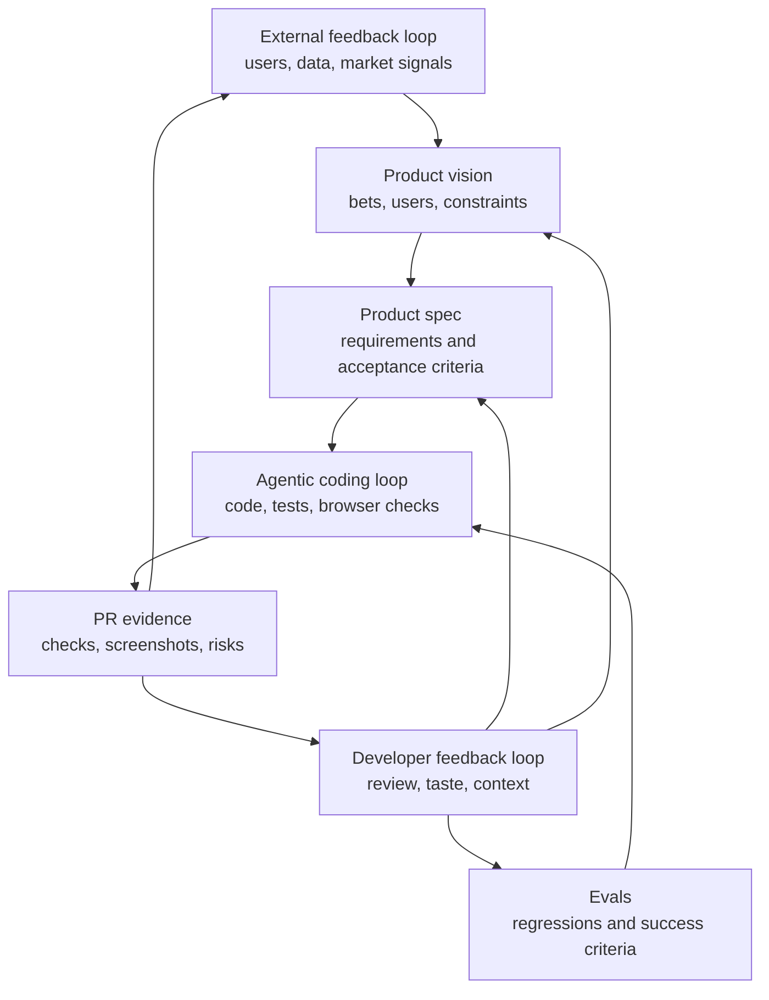

# Loop Engineering Framework for AI Agents

Loop engineering is the discipline of designing iteration systems for AI agents. The goal is to make software work concrete enough for agents to execute, verify, and improve, while humans keep control over product judgment and real-world context.

This framework is based on three nested loops:

1. Agentic coding loop
2. Developer feedback loop
3. External feedback loop

Each loop has a different cadence, owner, feedback signal, and output artifact.



## Loop Primitive

A loop is not just repeated work. A useful loop has a contract:

| Field | Definition |
| --- | --- |
| Input artifact | The document, data, or build state that starts the loop |
| Actor | The agent, developer, user group, or system responsible for action |
| Action | The work performed during the loop |
| Feedback signal | The evidence that says whether the action worked |
| Decision gate | The rule for accept, retry, escalate, or stop |
| Output artifact | The durable record that feeds the next loop |

If any field is missing, the loop becomes vague and requires human rescue.

## 1. Agentic Coding Loop

**Purpose:** Convert a product spec into working software with evidence that the implementation meets the spec.

**Cadence:** Minutes.

**Owner:** AI coding agent.

**Inputs:**

- Product spec
- Eval plan
- Existing codebase
- Constraints and non-goals
- Commands for tests, linting, type checks, build, and product inspection

**Actions:**

- Read the spec and acceptance criteria.
- Implement the smallest coherent slice.
- Run automated checks.
- Inspect the product directly when UI or workflow behavior matters.
- Fix defects and repeat until the exit gate is met.
- Return implementation evidence.

**Feedback signals:**

- Unit, integration, e2e, lint, type, and build results
- Browser or app screenshots
- Logs and runtime errors
- Eval dataset scores
- Acceptance criteria coverage

**Decision gate:**

- Accept when required checks pass and evidence covers the acceptance criteria.
- Retry when failures are local and the fix path is clear.
- Escalate when the spec is ambiguous, a dependency is blocked, or a product decision is required.
- Add an eval when the same failure mode appears twice.

**Output artifacts:**

- Code changes
- PR evidence
- Updated evals
- Known risks
- Questions for developer review

## 2. Developer Feedback Loop

**Purpose:** Inject human context, taste, product judgment, and prioritization into the system.

**Cadence:** Tens of minutes to hours.

**Owner:** Developer or product-minded engineer.

**Inputs:**

- Current product build
- Agent evidence
- Product vision
- User context not available to the agent
- External feedback summaries

**Actions:**

- Review the implemented workflow as a user would.
- Decide whether the current behavior is good enough to ship, needs another agent iteration, or changes the product direction.
- Clarify ambiguous parts of the spec.
- Convert repeated defects into evals.
- Create the next small agent task.

**Feedback signals:**

- Human review notes
- Product coherence
- UI and workflow quality
- Fit against the intended user and context
- Cost of further iteration versus value of shipping

**Decision gate:**

- Accept when the slice is useful, coherent, and supported by evidence.
- Iterate when the target is clear and the expected improvement is worth the cycle.
- Update the spec when implementation reveals ambiguity.
- Update the vision when the human's context advantage changes the product bet.
- Stop when more local iteration will not answer the important question.

**Output artifacts:**

- Developer review note
- Revised product spec
- New or changed evals
- Next agent task
- Decision log entry

## 3. External Feedback Loop

**Purpose:** Test whether the product direction is valid in the real world.

**Cadence:** Hours to weeks.

**Owner:** Developer, product team, users, customers, and market.

**Inputs:**

- Alpha or beta releases
- Customer conversations
- Usage analytics
- Support tickets
- Sales notes
- Competitive analysis
- A/B tests

**Actions:**

- Gather external signals.
- Separate observations from interpretations.
- Identify the strongest product hypothesis.
- Update the product vision and backlog.
- Decide what to build, measure, or stop doing next.

**Feedback signals:**

- Activation, retention, conversion, task success, and usage depth
- Qualitative feedback patterns
- User workarounds
- Repeated objections
- Competitive pressure
- Revenue or willingness-to-pay signals

**Decision gate:**

- Continue when feedback strengthens the current bet.
- Refine when the user need is real but the solution is wrong.
- Pivot when the target user, problem, or distribution path is invalidated.
- Pause when the next action would produce no new learning.

**Output artifacts:**

- External feedback digest
- Updated product vision
- New product bets
- Prioritized next specs
- Decision log entry

## Operating Protocol

Use this sequence for a new product slice:

1. Write or update the product vision.
2. Slice one user-visible improvement into a product spec.
3. Define evals before or alongside implementation.
4. Give the agent a bounded task.
5. Let the agent run the coding loop until it has evidence or a blocker.
6. Review the product, not just the diff.
7. Accept, iterate, update the spec, or update the vision.
8. Ship to the smallest useful external audience.
9. Capture external feedback and feed it back into the vision.

## Artifact System

| Artifact | Loop | Purpose |
| --- | --- | --- |
| `00-loop-map.yaml` | All loops | Shared map of owners, cadence, gates, and metrics |
| `01-product-vision.md` | External and developer | States the user, context advantage, bet, and constraints |
| `02-product-spec.md` | Developer to agent | Converts vision into implementable behavior |
| `03-eval-plan.md` | Agentic coding | Defines how the agent proves the work is correct |
| `04-agent-task.md` | Agentic coding | Bounded instruction packet for an AI coding agent |
| `05-pr-evidence.md` | Agentic coding to developer | Records checks, screenshots, risks, and coverage |
| `06-developer-review.md` | Developer feedback | Captures accept, iterate, pivot, or stop decisions |
| `07-external-feedback-digest.md` | External feedback | Turns user and market signals into product learning |
| `08-decision-log.md` | All loops | Durable history of major product and engineering decisions |

## Control Rules

- No agent task starts without acceptance criteria.
- No merge happens without evidence.
- No repeated failure mode survives twice without becoming an eval.
- No vision change happens without a stated source.
- No external feedback enters the backlog without interpretation and confidence.
- Every loop ends in accept, retry, escalate, stop, or ship.

## Metrics

Track loop health with lightweight metrics:

| Metric | Healthy Signal |
| --- | --- |
| Agent loop time | A bounded task reaches evidence within minutes to low hours |
| Review latency | Developer feedback arrives before context is lost |
| Eval growth | Repeated defects become automated or semi-automated checks |
| Spec churn | Ambiguity decreases over time for repeated workflows |
| External learning rate | Each release produces a clearer product bet |
| Human leverage | Developers spend less time as QA and more time on direction |

## When To Add Evals

Add or improve evals when:

- The agent repeats the same defect.
- A regression would be expensive to detect manually.
- The product has a critical workflow.
- The behavior depends on complex data, permissions, state, or timing.
- A subjective review can be turned into a checklist or benchmark.

Do not overbuild evals before the product direction is stable. Early products need learning speed; mature workflows need regression protection.

## Anti-Patterns

- **Spec theater:** Long specs with no acceptance criteria.
- **Agent babysitting:** Humans manually catch issues that tests or browser checks could catch.
- **Vision drift:** Every implementation changes direction without a recorded reason.
- **Feedback hoarding:** User feedback is collected but never turned into decisions.
- **Eval debt:** The same bug class appears repeatedly with no automated guardrail.
- **Infinite polish:** The team keeps iterating locally when only external feedback can answer the next question.

## Prompt Contract For Coding Agents

Use this contract when handing work to an agent:

```text
You are implementing one bounded product slice.

Inputs:
- Product vision:
- Product spec:
- Eval plan:
- Relevant files:
- Commands to run:

Rules:
- Keep changes scoped to the spec.
- Run the required checks.
- Inspect the product directly when workflow or UI behavior matters.
- Iterate until checks pass or you hit a blocker.
- Do not silently change product direction.

Return:
- What changed
- Evidence for each acceptance criterion
- Checks run and results
- Screenshots or logs when relevant
- Known risks
- Questions for developer review
```

## Developer Review Contract

Use this contract when reviewing an agent iteration:

```text
Decision: accept | iterate | change spec | change vision | stop

Review:
- Does the product behavior match the intended user outcome?
- Does the evidence cover the acceptance criteria?
- Is any issue a one-off bug or a missing eval?
- What human context should be injected into the next loop?
- What is the smallest next task worth giving to the agent?
```

## External Feedback Contract

Use this contract when turning external signals into product direction:

```text
Source:
Observation:
Interpretation:
Confidence:
Product implication:
Spec impact:
Eval impact:
Decision:
```

## Practical Cadence

For a 0-to-1 product:

- Run agentic coding loops continuously while building a bounded slice.
- Run developer feedback loops after each meaningful product state, usually every 30 to 120 minutes.
- Run external feedback loops as soon as a slice can teach you something, even if it is only with a few target users.

The key is not to automate the human out of the system. The key is to preserve the human context advantage while giving the agent enough structure to execute independently.
